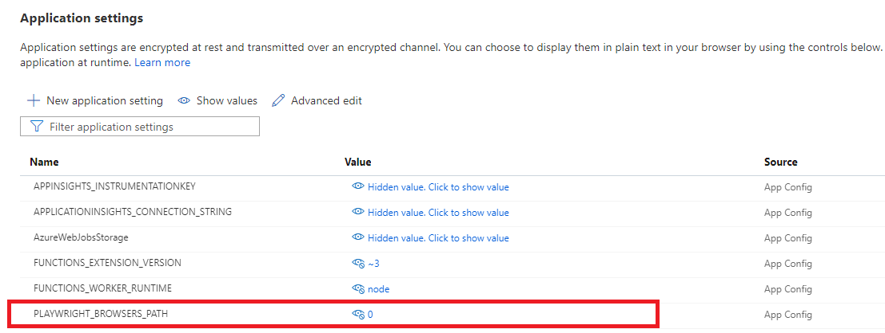

# Azure Function integration with Availability testing in Azure Monitor*

1. [API testing](#API%20testing%20in%20Azure%20Function)
2. [Browser testing](#Browser%20testing%20in%20Azure%20Function)
3. [Authentication in Azure Functions](#Authentication%20in%20Azure%20Functions)

*this is a part of private preview in Azure Monitor, please contact Carter.Socha@microsoft.com for more details if you would like to participate in.

<br/>

# API testing in Azure Function

### Create Azure Function with your custom code

1) Create Azure Function template in VS (VS 2017 or VS 2019) for C# or VSCode for JavaScript and choose HttpTrigger as an initial template configuration
2) Write custom code to ping your application 
3) Deploy your code to Azure Function app and connect Function app to Application Insights 


### Setup availability test
1) Get and copy your Azure Function URL by navigation to Function App -> Functions -> your function Overview blade in the Azure Portal

  

2) Navigate to Availability blade in the Azure Portal and create new web test, choose regular URL ping test and paste saved Azure Function URL

**NOTE** Selected locations actually do not matter, so you can choose only one or you might want to choose mutiple to have test execution more frequently (by choosing only one location you will have 5mins default test frequency).

  


<br>

### Optional AppInsights SDK configuration for JavaScript

Dependency calls are utomatically collected for C# but you need to do manual enablement of AppInsights SDK for Node.JS in order to collect generated outgoing dependency calls from your Function.
Full documentation for Node.JS SDK can be found [here](https://github.com/microsoft/ApplicationInsights-node.js/blob/develop/README.md).

1) Enable Application Insights SDK for Node.JS:

``` powershell
npm install applicationinsights --save
```

2) Setup SDK in the Function code:

``` javascript
const appInsights = require('applicationinsights');
appInsights.setup().start();
```

<br/>
<br/>

# Browser testing in Azure Function

Headless browser support for Chromium was recently added to the Azure Function consumption plan in Linux (not supported in Windows consumption plan) and you can either use it with some customizations (see references below) or build custom Docker image that includes chromium or other browser of your choice and deploy it to the Premium plan.

## 1. Playwright

### Prerequisites
Ensure that you have correct tooling for Azure Functions v3:

1. Install NodeJs

You must use NodeJs versions 10.x.x or 12.x.x. Use official [NodeJS website](https://nodejs.org/en/download/) to download and install the latest 12.x.x version. To check the installed version run the following command:
``` powershell
node -v
```

2. Install Azure Core Tools

The installation in Windows is through NodeJs, running the following command line in PowerShell or cmd:
``` powershell
npm install -g azure-functions-core-tools@3
```
To check the installed version run the following command:
``` powershell
func --version
```

### Pre-configuration
1. Create Azure Function template in VSCode for JavaScript and choose HttpTrigger as an initial template configuration. Ensure that Function v3 was created by checking **.vscode/settings.json** file - it should have projectRuntime set to 3:

``` json
"azureFunctions.projectRuntime": "~3",
```

2. Install Playwright npm module. Ensure that you are using the latest **1.5.\*** version, otherwise upgrade it to the latest.

``` powershell
npm install playwright-chromium
``` 

3. To have full integration with Playwright and have an ability to view all the actions taken during the testing, including failures and screenshots collected for each step you also need to install experimental appinsights-playwright npm package from myget.

``` powershell
npm install appinsights-playwright --registry=https://www.myget.org/F/applicationinsights-cat/npm/
``` 

### Generate the Playwright code

The easiest way to generate the actual test script is to use Record & Replay [CLI tool](https://github.com/microsoft/playwright-cli). This is also a great way to learn the Playwright API. Run **npx playwright-cli codegen** in your terminal and try it out now!

### Enable Application Insights collection

Use this sample as a prototype and replace you custom Playwright execution in this [function template](https://github.com/Azure/azure-functions-availability-monitoring-extension/tree/master/src/Demos/JavaScript-Monitoring-Samples). 

Details:
- Initialize AppInsightsContextListener at the beggining of your function code
- Wrap actual test execution in the try/catch/finally to have data still being collected and sent in the case of failure
- Serialize collected data in the response at the **finally** section

Resulting code should look like:

``` javascript
const { chromium } = require('playwright-chromium');
const { AppInsightsContextListener } = require('appinsights-playwright')

module.exports = async function (context, req) {    
    // initialize AppInsightsListener to collect information about Playwright execution
    // set input parameter to:
    //   - 'AutoCollect' to collect screenshots after every action taken
    //   - 'OnFailure' to collect screenshots only for the failed actions
    //   - 'No' to skip the screenshots collection. Default value.
    const listener = new AppInsightsContextListener('AutoCollect');

    try {
        // your custom Playwright code
    } catch (err) {
        context.log.error(err);
    } finally {
        // Serialize collected data into the response
        context.res = listener.serializeData();
        context.done();
    }    
};
```

**NOTE**
If you're using Record & Replay tool for code generation do the following modifications:
1) Rename **context** field to something else as it will conflict with context defined in HttpTrigger template and will cause compilcation issues. The following lines should be updated:
``` javascript
const context = await browser.newContext();
const page = await context.newPage();
// playwright actions...
await context.close();
```
2) Set **headless** parameter in **chromium.launch()** function to **true** (or remove it as **true** is default value)


Here is the full sample before and after the code changes:

1. Before:
``` javascript
const { chromium } = require('playwright-chromium');
const { AppInsightsContextListener } = require('appinsights-playwright')

module.exports = async function (context, req) {
    context.log("Function entered.");
    const browser = await chromium.launch({
        headless: false
    });
    const context = await browser.newContext();

    // Open new page
    const page = await context.newPage();

    await page.goto('https://www.bing.com/?toWww=1&redig=037D00CBA156451D8AFBC24E86985CDF');

    // Close page
    await page.close();

    // ---------------------
    await context.close();
    await browser.close();
};
```

1. After:
``` javascript
const { chromium } = require('playwright-chromium');
const { AppInsightsContextListener } = require('appinsights-playwright')

module.exports = async function (context, req) {
    context.log("Function entered.");

    // initialize AppInsightsListener to collect information about Playwright execution
    // set input parameter to:
    //   - 'AutoCollect' to collect screenshots after every action taken
    //   - 'OnFailure' to collect screenshots only for the failed actions
    //   - 'No' to skip the screenshots collection. Default value.
    const listener = new AppInsightsContextListener('AutoCollect');

    try {
        const browser = await chromium.launch();
        const browserContext = await browser.newContext();

        // Open new page
        const page = await browserContext.newPage();
        
        await page.goto('https://www.bing.com/?toHttps=1&redig=69CC3FCA85A84B3AAFA1D638964EA2B1');

        // Close page
        await page.close();

        // ---------------------
        await browserContext.close();
        await browser.close();

    } catch (err) {
        context.log.error(err);
    } finally {
        // Serialize collected data into the response
        context.res = listener.serializeData();
        context.done();
    }
};
```

<br/>

### Configuring Chromium download location

By default, Playwright downloads Chromium to a location outside the function app's folder. In order to include Chromium in the build artifacts, we need to instruct Playwright to install Chromium in the app's node_modules folder. To do this, navigate to Configuration blade of your Function App and create an app setting named **PLAYWRIGHT_BROWSERS_PATH** with a value of **0** in the function app in Azure. This setting is also used by Playwright at run-time to locate Chromium in node_modules.

  

Here you can also ensure that **FUNCTIONS_WORKER_RUNTIME** is set to **node** and **FUNCTIONS_EXTENSION_VERSION** is set to **~3**.

### Configuring VSCode for remote build

1. Enable scmDoBuildDuringDeployment setting
By default, the Azure Functions VS Code extension will deploy the app using local build, which means it'll run npm install locally and deploy the app package. For remote build, we update the app's **.vscode/settings.json** to enable **scmDoBuildDuringDeployment**.

``` json
{
    "azureFunctions.deploySubpath": ".",
    "azureFunctions.projectLanguage": "JavaScript",
    "azureFunctions.projectRuntime": "~3",
    "debug.internalConsoleOptions": "neverOpen",
    "azureFunctions.scmDoBuildDuringDeployment": true
}
```

We can also remove the postDeployTask and preDeployTask settings that runs npm commands before and after the deployment; they're not needed because we're running the build remotely.

2. Add node_modules folder to .funcignore
This excludes the **node_modules folder** from the deployment package to make the upload as small as possible and use only remote versions of the packages. File should look like [this](https://github.com/Azure/azure-functions-availability-monitoring-extension/tree/master/src/Demos/JavaScript-Monitoring-Samples/.funcignore).

3. Enable myget registry for remote build
As appinsights-playwright package is currently deployed only to myget the feed needs to be included as an additional npm feed during deloyment. To enable this create **.npmrc** file in the project root folder and put the following line, file should look like [this](https://github.com/Azure/azure-functions-availability-monitoring-extension/tree/master/src/Demos/JavaScript-Monitoring-Samples/.npmrc).

``` text
registry=https://www.myget.org/F/applicationinsights-cat/npm/
```

### Publish code 

1. Using VSCode

Use the **Azure Functions: Deploy to Function App...** command to publish the app. It'll recognize the settings we configured earlier and automatically use remote build.

2. Using Azure Functions Core Tools 

Run the command with the **--build remote** flag:

``` powershell
func azure functionapp publish <YourAzureFunctionName> --build remote
``` 

### Create availability test

Follow instructions above in the **Setup availability test** section how to create the availability URL ping test.

After setup is done, wait till results appear in the Availability blade:


And click on Load test steps button to see more details of Playwright test execution:


### Troubleshooting

If you don't see any additional Playwright steps in E2E to blade, try to do the following:
1) Navigate to Function App -> Functions -> your function Code + Test blade
2) Click Test/Run button in the command bar
3) Change HttpMethod type to GET
4) Click Run
5) Open different tab in browser and call you function URL
6) Move back to Code + Test blade and check opened Logs console panel for exceptions


If you see the following exception generated it means that remote build didn't work for you. Please double check that you configured remote build in VSCode and specified **PLAYWRIGHT_BROWSERS_PATH** app setting correctly:

```diff
- 2020-10-14T23:36:20.789 [Error] browserType.launch: Failed to launch chromium because executable doesn't exist at D:\home\site\wwwroot\node_modules\playwright-chromium\.local-browsers\chromium-815036\chrome-win\chrome.exeTry re-installing playwright with "npm install playwright"
```

If there are no exceptions in the log but you're getting empty response that looks like JSON below then mostly likely you forgot to include node_modules folder to .funcignore. Please carefully review all steps in **Configuring VSCode for remote build** section.

```json
{"type":"playwright","steps":[]}
```

### Additional useful information

- Some generic samples like authentication can be found [here](https://github.com/microsoft/playwright/tree/master/docs/examples).
- If you would like to use custom Docker image instead of Consumption plan you can find the documentation with already included browsers [here](https://github.com/microsoft/playwright/tree/master/docs/docker).


## 2. Selenium

- JavaScript documentation can be found [here](https://www.selenium.dev/selenium/docs/api/javascript/). We don't have default integration as of today.

<br/>
<br/>

# Authentication in Azure Functions

One of the most common questions is how to use secrets in Azure Function when you want to do authentication during API test for example. The newest and the most recommended approach is to use the integration between Azure Functions (App Services) and a Key Vault.
[This article](https://docs.microsoft.com/azure/app-service/app-service-key-vault-references) shows you how to work with secrets from Azure Key Vault in your App Service or Azure Functions application without requiring any code changes. 
