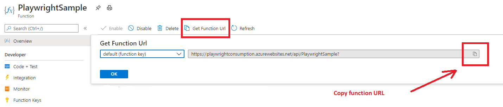
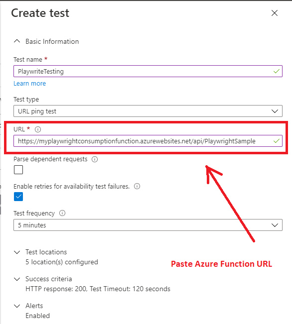
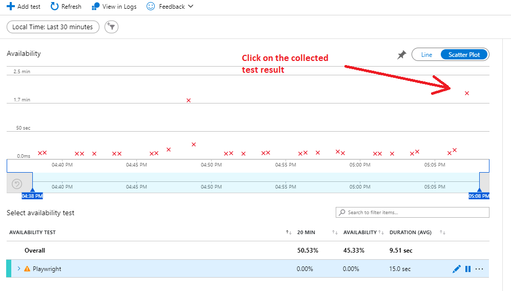
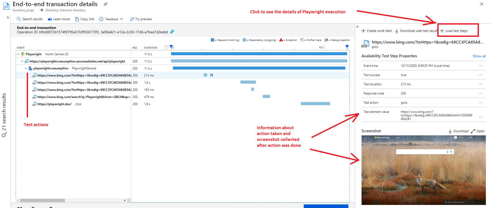

# Setting up Azure Function

1. [C#](#Azure%20Function%20in%20C#)
2. [JavaScript](#Azure%20Function%20in%20JavaScript)
3. [Browser testing](#Azure%20Function%20for%20browser%20testing)


# API testing in Azure Function

1) Create Azure Function template in VS (VS 2017 or VS 2019) for C# or VSCode for JavaScript and choose HttpTrigger as an initial template configuration
2) Write custom code to ping your application 
3) Deploy your code to Azure Function app and connect Function app to Application Insights 
4) Navigate to Availability blade in the Azure Portal and create new web test, choose regular URL ping test and copy paste Azure Function URL:

  

  


<br>

Optinally you can also enable AppInsights SDK for Node.JS in order to collect generated outgoing dependency calls from your Function.
Full documentation for Node.JS SDK can be found [here](https://github.com/microsoft/ApplicationInsights-node.js/blob/develop/README.md).

1) Enable Application Insights SDK for Node.JS:

``` powershell
npm install applicationinsights --save
```

2) Setup SDK in the Function code:

``` javascript
const appInsights = require('applicationinsights');
appInsights.setup().start();
```

<br>

# Browser testing

Headless browser support for Chromium was recently added to the Azure Function consumption plan in Linux (not supported in Windows consumption plan) and you can either use it with some customizations (see references below) or build custom Docker image that includes chromium or other browser of your choice and deploy it to the Premium plan.

## 1. Playwright

### Pre-configuration
Create Azure Function template in VSCode for JavaScript and choose HttpTrigger as an initial template configuration and install Playwright npm module. Ensure that you are using the latest 1.5.0 version, otherwise upgrade it to the latest.

``` powershell
npm install playwright-chromium
``` 

To have full integration with Playwright and have an ability to view all the actions taken during the testing, including failures and screenshots collected for each step you also need to install experimental appinsights-playwright npm package from myget.

``` powershell
npm install appinsights-playwright --registry=https://www.myget.org/F/applicationinsights-cat/npm/
``` 

### Generate the Playwright code

The easiest way to generate the actual test script is to use Record & Replay [CLI tool](https://github.com/microsoft/playwright-cli). This is also a great way to learn the Playwright API. Run **npx playwright-cli codegen** in your terminal and try it out now!

### Enable Application Insights collection

Use this sample as a prototype and replace you custom Playwright execution in this [function template](https://github.com/Azure/azure-functions-availability-monitoring-extension/tree/master/src/Demos/JavaScript-Monitoring-Samples). 

Details:
- Initialize AppInsightsContextListener at the beggining of your function code
- Wrap actual test execution in the try/finally to have data still being collected and sent in the case of failure
- Serialize collected data in the response at the **finally** step

Resulting code should look like:

``` javascript
const { chromium } = require('playwright-chromium');
const { AppInsightsContextListener } = require('appinsights-playwright')

module.exports = async function (context, req) {    
    // initialize AppInsightsListener to collect information about Playwright execution
    // set input parameter to:
    //   - 'AutoCollect' to collect screenshots after every action taken
    //   - 'OnFailure' to collect screenshots only for the failed actions
    //   - 'No' to skip the screenshots collection. Default value.
    const listener = new AppInsightsContextListener('AutoCollect');

    try {
        // you custom Playwright code
    } finally {
        // Serialize collected data into the response
        context.res = listener.serializeData();
        context.done();
    }    
};
```

**NOTE**
If you're using Record & Replay tool for code generation rename **context** field to something else as it will conflict with context defined in HttpTrigger template and will cause compilcation issues:

Before: 
``` javascript
const context = await browser.newContext();
const page = await context.newPage();
```

After:
``` javascript
const browserContext = await browser.newContext();
const page = await browserContext.newPage();
```

<br/>

### Configuring Chromium download location

By default, Playwright downloads Chromium to a location outside the function app's folder. In order to include Chromium in the build artifacts, we need to instruct Playwright to install Chromium in the app's node_modules folder. To do this, create an app setting named **PLAYWRIGHT_BROWSERS_PATH** with a value of **0** in the function app in Azure. This setting is also used by Playwright at run-time to locate Chromium in node_modules.

### Publish code 

Use Azure Functions Core Tools and run the command with the **--build remote** flag:

``` powershell
func azure functionapp publish <YourAzureFunctionName> --build remote
``` 

### Create availability test

Follow instructions above in the API testing section how to create the availability URL ping test.

After setup is done, wait till results appear in the Availability blade:




And click on Load test steps button to see more details of Playwright test execution:



### Additional useful information

- Some generic samples like authentication can be found [here](https://github.com/microsoft/playwright/tree/master/docs/examples).
- If you would like to use custom Docker image instead of Consumption plan you can find the documentation with already included browsers [here](https://github.com/microsoft/playwright/tree/master/docs/docker).


## 2. Selenium

- JavaScript documentation can be found [here](https://www.selenium.dev/selenium/docs/api/javascript/). We don't have default integration as of today.
